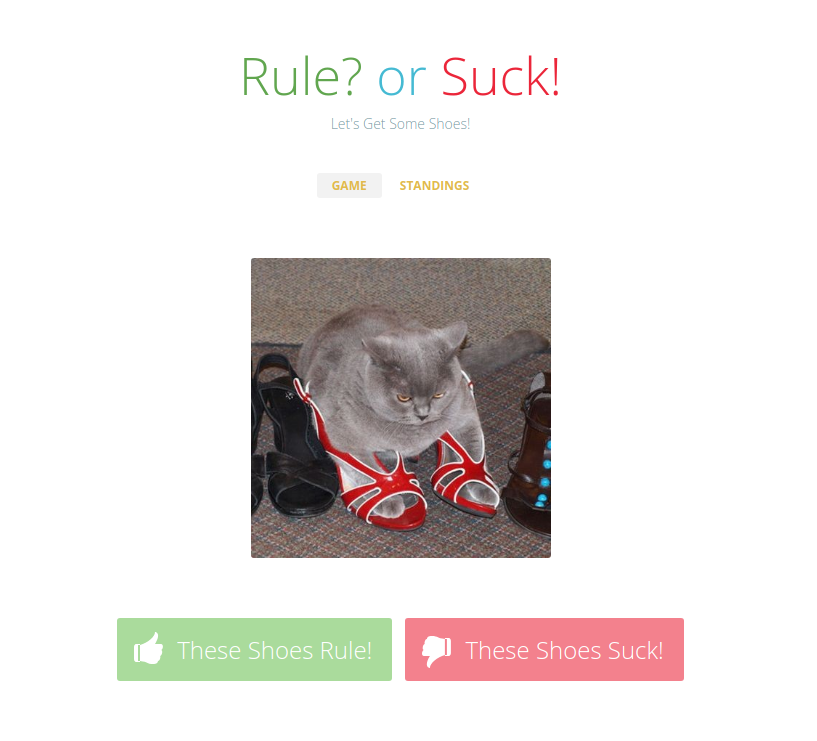

# Shoes

Let's get some shoes!

To run this web application, run:

```bash
$ node index.js
```

And open your browser to [localhost:3636](http://localhost:3636/)
You will see a voting portal to vote for your favorite shoes :) That's it!


